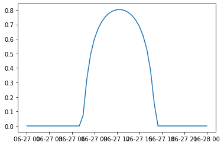

# Solarlib


```python
from solarlib.location import Location
import datetime
import pytz
```

## Define a location


```python
latitude = -31.9505
longitude = 115.8605
timezone = 'Australia/Perth'
perth = Location(latitude,longitude,timezone)
```

## Sunrise
The output is a python datetime object.


```python
print(perth.sunrise('2020-06-27'))
```

    2020-06-27 07:17:33.495057+08:00
    

## Sunset
The output is a python datetime object.


```python
print(perth.sunset('2020-06-27'))
```

    2020-06-27 17:21:50.791503+08:00
    

## Day length
The output is a python timedelta object.


```python
print(perth.day_length('2020-06-27'))
```

    10:04:17.296446
    

## Solar irradiance
The output is irradiance in $kW/m^2$.


```python
perth.solar_irradiance('2020-06-27 14:27:00')
```


    0.7360521598862617


## Irradiance throughout a day


```python
import matplotlib.pyplot as plt
```


```python
output = perth.daily_irradiance('2020-06-27')
time, irradiance = list(zip(*output))
plt.plot(time,irradiance)
```




